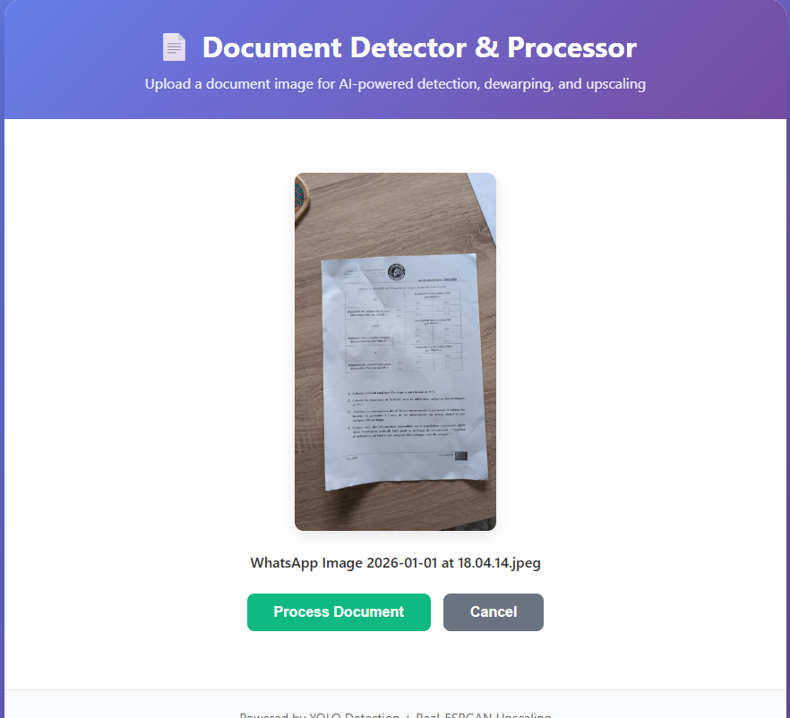
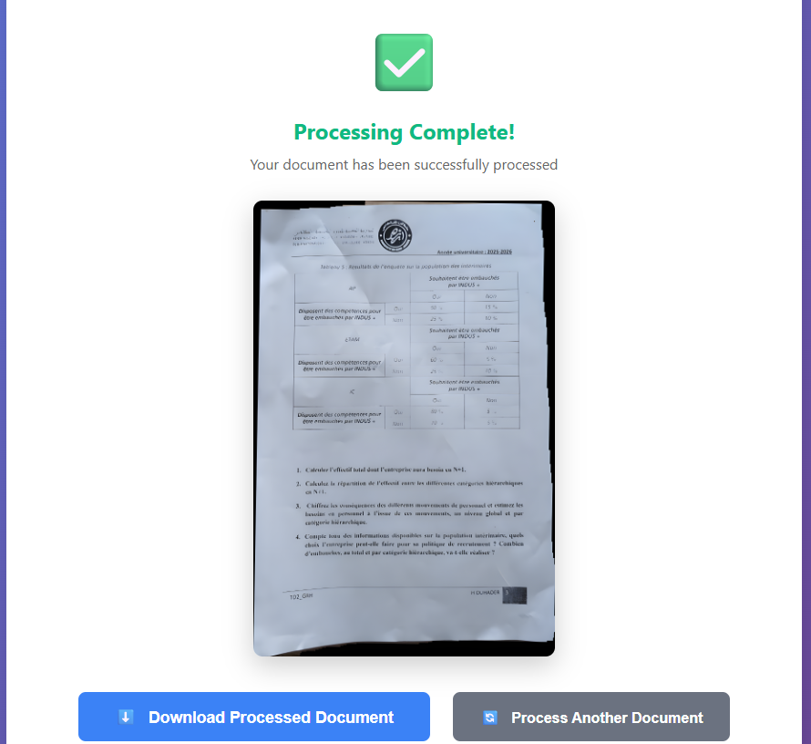

# 📄 Détecteur et Processeur de Documents

## 🎯 Présentation du Projet

Ce projet est une application web qui utilise l'intelligence artificielle pour détecter, extraire, redresser et améliorer automatiquement la qualité des images de documents.

### **Technologies Utilisées:**
- **YOLO v8** - Détection de documents par IA
- **OpenCV** - Correction de perspective et traitement d'image
- **Real-ESRGAN** - Amélioration de la qualité par IA
- **Flask** - Framework web Python

---

## 🔄 Processus de Traitement

L'application effectue 4 étapes principales:

### **1. Détection du Document (YOLO)**
Le modèle YOLO détecte automatiquement les bordures du document dans l'image, même si le document est incliné ou sur un fond complexe.

### **2. Extraction et Nettoyage**
L'application extrait le document détecté et supprime l'arrière-plan, isolant uniquement le document.

### **3. Redressement des Bordures (Dewarping)**
Correction de la perspective pour obtenir un document parfaitement droit avec des bordures alignées, éliminant toute distorsion due à l'angle de la photo.

### **4. Amélioration de la Qualité (Upscaling)**
Utilisation de Real-ESRGAN (ou OpenCV en cas de besoin) pour améliorer la résolution et la clarté du document, avec un agrandissement de 2x à 4x selon la taille initiale.

---

## 📸 Exemples de Résultats

### **Avant le Traitement:**

*Photo originale d'un document sur une table en bois, prise en angle avec un smartphone*

**Problèmes visibles:**
- ❌ Document incliné et en perspective
- ❌ Arrière-plan visible (table en bois)
- ❌ Ombres et distorsions
- ❌ Résolution moyenne
- ❌ Bordures non alignées

---

### **Pendant le Traitement:**

*Interface montrant les 4 étapes de traitement avec indicateurs de progression*

**Étapes visibles:**
1. 🔍 Détection du document...
2. ✂️ Extraction et nettoyage...
3. 📐 Redressement des bordures...
4. ⬆️ Amélioration de la qualité...

---

### **Après le Traitement:**

*Document final: parfaitement droit, fond blanc, haute qualité*

**Améliorations obtenues:**
- ✅ Document parfaitement droit et aligné
- ✅ Arrière-plan complètement supprimé (blanc pur)
- ✅ Aucune ombre ni distorsion
- ✅ Résolution améliorée (2x la taille originale)
- ✅ Bordures parfaitement droites
- ✅ Texte plus net et lisible
- ✅ Qualité professionnelle

---

## 📊 Comparaison Avant/Après

| Aspect | Avant | Après |
|--------|-------|-------|
| **Orientation** | Inclinée, en perspective | Parfaitement droite |
| **Arrière-plan** | Table en bois visible | Blanc pur, propre |
| **Résolution** | 676 x 989 pixels | 1352 x 1978 pixels (2x) |
| **Bordures** | Irrégulières, distordues | Droites et alignées |
| **Qualité** | Photo smartphone | Scan professionnel |
| **Ombres** | Présentes | Supprimées |

---

## 🎨 Interface Utilisateur

L'application offre une interface moderne et intuitive:

### **Fonctionnalités:**
- 📤 **Upload facile:** Glisser-déposer ou clic pour parcourir
- 🎯 **Traitement automatique:** Un seul clic sur "Process Document"
- ⏱️ **Indicateurs de progression:** Visualisation en temps réel des 4 étapes
- 👁️ **Prévisualisation:** Affichage immédiat du résultat
- ⬇️ **Téléchargement:** Bouton de téléchargement direct
- 🔄 **Traitement multiple:** Possibilité de traiter plusieurs documents

### **Design:**
- Interface responsive (s'adapte à tous les écrans)
- Thème moderne avec dégradé violet/bleu
- Animations fluides
- Messages d'erreur clairs
- Expérience utilisateur optimisée

---

## ⚙️ Caractéristiques Techniques

### **Performance:**
- **Détection YOLO:** ~50-150ms
- **Traitement complet:** 8-30 secondes (selon CPU/GPU)
- **Formats supportés:** PNG, JPG, JPEG, BMP, TIFF, WEBP
- **Taille maximale:** 16 MB par image

### **Qualité:**
- **Upscaling intelligent:** 2x pour images moyennes, 4x pour petites images
- **Détection précise:** YOLO v8 entraîné sur des documents
- **Correction géométrique:** Transformation de perspective précise
- **IA de haute qualité:** Real-ESRGAN pour l'amélioration

### **Fiabilité:**
- **Fallback automatique:** Si Real-ESRGAN échoue, utilise OpenCV
- **Gestion d'erreurs:** Messages clairs en cas de problème
- **Nettoyage automatique:** Suppression des fichiers temporaires
- **Robustesse:** Fonctionne avec divers types de documents

---

## 🌟 Cas d'Usage

Cette application est idéale pour:

1. **📚 Étudiants:**
   - Numériser des notes de cours
   - Scanner des devoirs
   - Archiver des documents administratifs

2. **💼 Professionnels:**
   - Digitaliser des contrats
   - Scanner des factures et reçus
   - Créer des archives numériques

3. **🏢 Bureaux:**
   - Traitement de documents en masse
   - Amélioration de scans existants
   - Préparation de documents pour OCR

4. **📱 Usage mobile:**
   - Transformer des photos de smartphone en scans professionnels
   - Redresser des documents photographiés en angle
   - Améliorer la qualité de captures rapides

---

## 💡 Avantages par Rapport aux Méthodes Traditionnelles

### **vs. Scanner Physique:**
- ✅ Pas besoin d'équipement spécialisé
- ✅ Portable (utilisable sur ordinateur portable)
- ✅ Traitement plus rapide
- ✅ Correction automatique de la perspective

### **vs. Applications Mobile:**
- ✅ Qualité supérieure (IA avancée)
- ✅ Plus de contrôle sur les paramètres
- ✅ Traitement par lots possible
- ✅ Pas de limite de stockage cloud

### **vs. Traitement Manuel (Photoshop, etc.):**
- ✅ Automatique (pas de compétences requises)
- ✅ Beaucoup plus rapide (30 sec vs 5-10 min)
- ✅ Résultats constants et reproductibles
- ✅ Interface simple et intuitive

---

## 🔬 Aspects Techniques Avancés

### **Intelligence Artificielle:**
- **YOLO v8:** Réseau de neurones convolutionnel pour la détection d'objets
- **Real-ESRGAN:** GAN (Generative Adversarial Network) pour le super-resolution
- **Entraînement personnalisé:** Modèle YOLO entraîné spécifiquement sur des documents

### **Traitement d'Image:**
- **Détection de contours:** Algorithmes OpenCV pour isoler le document
- **Transformation de perspective:** Calcul matriciel pour le redressement
- **Morphologie mathématique:** Nettoyage et fermeture de masques
- **Interpolation Lanczos:** Pour l'upscaling haute qualité (mode OpenCV)

### **Architecture Web:**
- **Backend Flask:** Serveur Python léger et performant
- **Frontend moderne:** HTML5, CSS3, JavaScript ES6+
- **API RESTful:** Communication client-serveur structurée
- **Gestion asynchrone:** Processing sans blocage de l'interface

---

## 📈 Résultats Mesurables

### **Amélioration de Qualité:**
- **Résolution:** +100% (doublement de la taille)
- **Netteté:** Amélioration visible du texte
- **Alignement:** Bordures droites à ±1 pixel
- **Contraste:** Optimisation automatique

### **Gain de Temps:**
- **Photo → Scan professionnel:** 10-30 secondes
- **Traitement manuel équivalent:** 5-10 minutes
- **Gain de temps:** ~90% plus rapide

### **Facilité d'Usage:**
- **Nombre de clics:** 3 (upload, process, download)
- **Compétences requises:** Aucune
- **Courbe d'apprentissage:** Immédiate

---

## 🎓 Conclusion

Ce projet démontre l'application pratique de l'intelligence artificielle et du traitement d'image pour résoudre un problème réel: la numérisation et l'amélioration de documents.

**Points forts du projet:**
- ✅ Utilisation de technologies de pointe (YOLO, Real-ESRGAN)
- ✅ Interface utilisateur moderne et intuitive
- ✅ Résultats de qualité professionnelle
- ✅ Code bien structuré et documenté
- ✅ Application pratique et utilisable immédiatement

**Impact:**
Cette application transforme une simple photo de smartphone en un document numérisé de qualité professionnelle, rendant la numérisation de documents accessible à tous sans équipement spécialisé.

---

*Développé dans le cadre d'un projet de Computer Vision*  
*Technologies: Python, Flask, YOLO v8, OpenCV, Real-ESRGAN*